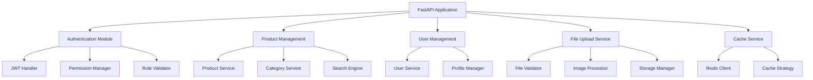
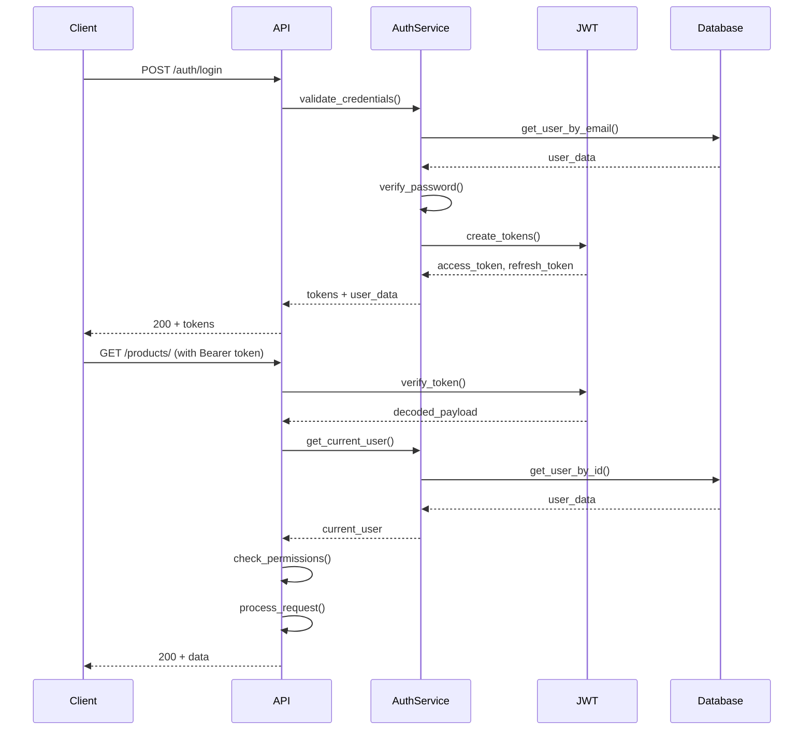

# 🏗️ System Architecture - API Nhan88ng

**Comprehensive system architecture documentation for the Nhan88ng e-commerce platform**

---

## 📋 **Table of Contents**

1. [System Overview](#-system-overview)
2. [Architecture Patterns](#-architecture-patterns)
3. [Component Architecture](#-component-architecture)
4. [Data Architecture](#-data-architecture)
5. [Security Architecture](#-security-architecture)
6. [Deployment Architecture](#-deployment-architecture)
7. [Performance Architecture](#-performance-architecture)
8. [Scalability Considerations](#-scalability-considerations)
9. [Integration Architecture](#-integration-architecture)
10. [Monitoring & Observability](#-monitoring--observability)

---

## 🎯 **System Overview**

### **High-Level Architecture**

```
┌─────────────────┐    ┌─────────────────┐    ┌─────────────────┐
│   Web Clients   │    │  Mobile Apps    │    │  Third-party    │
│                 │    │                 │    │  Integrations   │
└─────────┬───────┘    └─────────┬───────┘    └─────────┬───────┘
          │                      │                      │
          └──────────────────────┼──────────────────────┘
                                 │
                    ┌────────────┼────────────┐
                    │       Load Balancer     │
                    │      (Nginx/HAProxy)    │
                    └────────────┼────────────┘
                                 │
          ┌──────────────────────┼──────────────────────┐
          │              API Gateway/Reverse Proxy     │
          │                   (Nginx)                  │
          └──────────────────────┼──────────────────────┘
                                 │
    ┌─────────────┬──────────────┼──────────────┬─────────────┐
    │             │              │              │             │
┌───▼───┐    ┌───▼───┐      ┌───▼───┐      ┌───▼───┐    ┌───▼───┐
│FastAPI│    │FastAPI│      │FastAPI│      │FastAPI│    │FastAPI│
│App 1  │    │App 2  │      │App 3  │      │App 4  │    │App N  │
│(Port  │    │(Port  │      │(Port  │      │(Port  │    │(Port  │
│8001)  │    │8002)  │      │8003)  │      │8004)  │    │800N)  │
└───┬───┘    └───┬───┘      └───┬───┘      └───┬───┘    └───┬───┘
    │            │              │              │            │
    └────────────┼──────────────┼──────────────┼────────────┘
                 │              │              │
         ┌───────▼─────┐ ┌──────▼──────┐ ┌────▼─────┐
         │   MongoDB   │ │    Redis    │ │  File    │
         │   Cluster   │ │   Cache     │ │ Storage  │
         │             │ │             │ │          │
         └─────────────┘ └─────────────┘ └──────────┘
```

### **System Characteristics**

| Aspect | Description |
|--------|-------------|
| **Architecture Style** | Layered Monolith with Microservice Readiness |
| **API Design** | RESTful API with OpenAPI 3.0 |
| **Authentication** | JWT-based with Role-Based Access Control |
| **Data Storage** | Document-based (MongoDB) with Redis caching |
| **File Handling** | Local filesystem with S3-compatible interface |
| **Deployment** | Docker containers with orchestration support |
| **Scalability** | Horizontal and vertical scaling capable |
| **Performance** | Sub-100ms response times with caching |

---

## 🏛️ **Architecture Patterns**

### **1. Layered Architecture**

```
┌─────────────────────────────────────────────────────────┐
│                  Presentation Layer                     │
│  ┌─────────────┐ ┌─────────────┐ ┌─────────────────────┐│
│  │  FastAPI    │ │  OpenAPI    │ │  HTTP Middleware    ││
│  │  Routers    │ │  Docs       │ │  CORS, Security     ││
│  └─────────────┘ └─────────────┘ └─────────────────────┘│
└─────────────────────────────────────────────────────────┘
│
┌─────────────────────────────────────────────────────────┐
│                   Business Layer                        │
│  ┌─────────────┐ ┌─────────────┐ ┌─────────────────────┐│
│  │  Service    │ │  Domain     │ │  Business Logic     ││
│  │  Classes    │ │  Models     │ │  Validation         ││
│  └─────────────┘ └─────────────┘ └─────────────────────┘│
└─────────────────────────────────────────────────────────┘
│
┌─────────────────────────────────────────────────────────┐
│                  Data Access Layer                      │
│  ┌─────────────┐ ┌─────────────┐ ┌─────────────────────┐│
│  │  Repository │ │  Database   │ │  Cache              ││
│  │  Pattern    │ │  Models     │ │  Management         ││
│  └─────────────┘ └─────────────┘ └─────────────────────┘│
└─────────────────────────────────────────────────────────┘
│
┌─────────────────────────────────────────────────────────┐
│                Infrastructure Layer                     │
│  ┌─────────────┐ ┌─────────────┐ ┌─────────────────────┐│
│  │  Database   │ │  File       │ │  External           ││
│  │  MongoDB    │ │  Storage    │ │  Services           ││
│  └─────────────┘ └─────────────┘ └─────────────────────┘│
└─────────────────────────────────────────────────────────┘
```

### **2. Domain-Driven Design (DDD)**

```python
# Domain Structure
src/
├── app/
│   ├── api/v1/endpoints/          # Presentation Layer
│   ├── core/                      # Infrastructure
│   ├── models/                    # Domain Models
│   ├── schemas/                   # Data Transfer Objects
│   ├── services/                  # Business Logic
│   └── repositories/              # Data Access
```

### **3. Repository Pattern**

```python
# Abstract Repository
class BaseRepository(ABC):
    @abstractmethod
    async def create(self, obj: dict) -> str:
        pass
    
    @abstractmethod
    async def get_by_id(self, id: str) -> Optional[dict]:
        pass
    
    @abstractmethod
    async def update(self, id: str, obj: dict) -> bool:
        pass
    
    @abstractmethod
    async def delete(self, id: str) -> bool:
        pass

# Concrete Implementation
class ProductRepository(BaseRepository):
    def __init__(self, database: Database):
        self.collection = database.products
    
    async def create(self, product: dict) -> str:
        result = await self.collection.insert_one(product)
        return str(result.inserted_id)
    
    async def get_by_shop(self, shop: str) -> List[dict]:
        cursor = self.collection.find({"shop": shop})
        return await cursor.to_list(None)
```

---

## 🧩 **Component Architecture**

### **1. Core Components**



### **2. Module Dependencies**

```python
# Dependency Injection Container
class Container:
    def __init__(self):
        self.wiring_config = {
            "packages": ["app"]
        }
    
    # Database
    database = providers.Singleton(
        get_database_connection,
        mongodb_url=config.MONGODB_URL
    )
    
    # Repositories
    product_repository = providers.Factory(
        ProductRepository,
        database=database
    )
    
    user_repository = providers.Factory(
        UserRepository,
        database=database
    )
    
    # Services
    product_service = providers.Factory(
        ProductService,
        repository=product_repository,
        cache_service=cache_service
    )
    
    auth_service = providers.Factory(
        AuthService,
        user_repository=user_repository
    )
```

### **3. Service Layer Design**

```python
# Service Interface
class ProductService:
    def __init__(
        self,
        repository: ProductRepository,
        cache_service: CacheService,
        search_service: SearchService
    ):
        self.repository = repository
        self.cache = cache_service
        self.search = search_service
    
    async def create_product(self, product_data: ProductCreate, user: User) -> Product:
        # Business logic validation
        self._validate_product_data(product_data)
        self._check_permissions(user, "product:write")
        
        # Create product
        product = await self.repository.create(product_data.dict())
        
        # Update search index
        await self.search.index_product(product)
        
        # Invalidate cache
        await self.cache.delete_pattern(f"products:{product['shop']}:*")
        
        return Product(**product)
    
    async def get_products_by_shop(
        self, 
        shop: str, 
        filters: ProductFilters
    ) -> PaginatedProducts:
        # Check cache first
        cache_key = f"products:{shop}:{filters.cache_key()}"
        cached = await self.cache.get(cache_key)
        if cached:
            return PaginatedProducts(**cached)
        
        # Query database
        products = await self.repository.get_by_shop_with_filters(shop, filters)
        
        # Cache results
        await self.cache.set(cache_key, products, ttl=3600)
        
        return products
```

---

## 🗄️ **Data Architecture**

### **1. Database Schema Design**

```javascript
// MongoDB Collections Structure

// Users Collection
{
  "_id": ObjectId,
  "email": "user@domain.com",
  "hashed_password": "bcrypt_hash",
  "full_name": "User Name",
  "shop": "tinashop",
  "role": "customer|admin|manager",
  "permissions": ["product:read", "order:write"],
  "profile": {
    "phone": "+1234567890",
    "avatar": "/static/images/users/avatar.jpg",
    "preferences": {}
  },
  "is_active": true,
  "is_verified": false,
  "email_verified_at": null,
  "last_login_at": ISODate,
  "created_at": ISODate,
  "updated_at": ISODate,
  "metadata": {}
}

// Products Collection
{
  "_id": ObjectId,
  "name": "Product Name",
  "description": "Detailed description",
  "short_description": "Short description",
  "slug": "product-name",
  "sku": "PROD-001",
  "barcode": "1234567890123",
  "price": 99.99,
  "compare_price": 129.99,
  "cost_price": 60.00,
  "category_ids": [ObjectId],
  "categories": [
    {
      "id": ObjectId,
      "name": "Category Name",
      "slug": "category-name"
    }
  ],
  "tags": ["tag1", "tag2"],
  "images": [
    {
      "url": "/static/images/products/image.jpg",
      "alt": "Image description",
      "is_primary": true,
      "sort_order": 0
    }
  ],
  "variants": [
    {
      "id": ObjectId,
      "name": "Size: M",
      "sku": "PROD-001-M",
      "price": 99.99,
      "stock_quantity": 10,
      "attributes": {
        "size": "M",
        "color": "Blue"
      }
    }
  ],
  "stock_quantity": 100,
  "track_inventory": true,
  "allow_backorder": false,
  "weight": 1.5,
  "dimensions": {
    "length": 10.0,
    "width": 5.0,
    "height": 2.0,
    "unit": "cm"
  },
  "status": "active|draft|archived",
  "is_featured": false,
  "seo": {
    "meta_title": "SEO Title",
    "meta_description": "SEO Description",
    "canonical_url": "https://domain.com/products/slug"
  },
  "shop": "tinashop",
  "created_by": ObjectId,
  "updated_by": ObjectId,
  "created_at": ISODate,
  "updated_at": ISODate,
  "published_at": ISODate,
  "view_count": 0,
  "sales_count": 0,
  "rating": {
    "average": 4.5,
    "count": 25
  }
}

// Categories Collection
{
  "_id": ObjectId,
  "name": "Category Name",
  "description": "Category description",
  "slug": "category-name",
  "parent_id": ObjectId,
  "image": "/static/images/categories/category.jpg",
  "is_active": true,
  "sort_order": 0,
  "seo": {
    "meta_title": "Category SEO Title",
    "meta_description": "Category SEO Description"
  },
  "shop": "tinashop",
  "created_at": ISODate,
  "updated_at": ISODate,
  "product_count": 10
}
```

### **2. Database Indexes**

```javascript
// Performance Indexes
db.products.createIndex({ "shop": 1, "status": 1 });
db.products.createIndex({ "shop": 1, "category_ids": 1 });
db.products.createIndex({ "shop": 1, "price": 1 });
db.products.createIndex({ "shop": 1, "created_at": -1 });
db.products.createIndex({ "slug": 1, "shop": 1 }, { unique: true });
db.products.createIndex({ "sku": 1 }, { unique: true });
db.products.createIndex({ "name": "text", "description": "text", "tags": "text" });

// Compound indexes for complex queries
db.products.createIndex({ 
  "shop": 1, 
  "status": 1, 
  "is_featured": 1, 
  "created_at": -1 
});

db.products.createIndex({ 
  "shop": 1, 
  "category_ids": 1, 
  "price": 1, 
  "status": 1 
});

// User indexes
db.users.createIndex({ "email": 1 }, { unique: true });
db.users.createIndex({ "shop": 1, "role": 1 });
db.users.createIndex({ "is_active": 1, "is_verified": 1 });

// Category indexes
db.categories.createIndex({ "shop": 1, "is_active": 1 });
db.categories.createIndex({ "shop": 1, "parent_id": 1 });
db.categories.createIndex({ "slug": 1, "shop": 1 }, { unique: true });
```

### **3. Data Flow Architecture**

```
┌─────────────┐    ┌─────────────┐    ┌─────────────┐
│   Request   │───▶│ Validation  │───▶│  Service    │
│             │    │  & Auth     │    │   Logic     │
└─────────────┘    └─────────────┘    └─────┬───────┘
                                             │
┌─────────────┐    ┌─────────────┐    ┌─────▼───────┐
│  Response   │◀───│   Cache     │◀───│ Repository  │
│             │    │   Layer     │    │   Layer     │
└─────────────┘    └─────────────┘    └─────┬───────┘
                                             │
                                     ┌─────▼───────┐
                                     │  Database   │
                                     │  (MongoDB)  │
                                     └─────────────┘
```

---

## 🔒 **Security Architecture**

### **1. Authentication & Authorization Flow**



### **2. Security Layers**

```python
# Security Middleware Stack
app.add_middleware(SecurityHeadersMiddleware)
app.add_middleware(RateLimitMiddleware)
app.add_middleware(CORSMiddleware)
app.add_middleware(TrustedHostMiddleware)

# Security Headers Middleware
class SecurityHeadersMiddleware:
    async def __call__(self, request, call_next):
        response = await call_next(request)
        
        # Security headers
        response.headers["X-Frame-Options"] = "DENY"
        response.headers["X-Content-Type-Options"] = "nosniff"
        response.headers["X-XSS-Protection"] = "1; mode=block"
        response.headers["Strict-Transport-Security"] = "max-age=31536000; includeSubDomains"
        response.headers["Referrer-Policy"] = "strict-origin-when-cross-origin"
        response.headers["Content-Security-Policy"] = "default-src 'self'"
        
        return response
```

### **3. Permission System**

```python
# Role-Based Access Control
class PermissionChecker:
    ROLE_PERMISSIONS = {
        "customer": [
            "product:read",
            "order:read",
            "order:write",
            "profile:read",
            "profile:write"
        ],
        "admin": [
            "user:read", "user:write", "user:delete",
            "product:read", "product:write", "product:delete",
            "category:read", "category:write", "category:delete",
            "order:read", "order:write", "order:delete",
            "admin:panel", "system:admin"
        ]
    }
    
    def check_permission(self, user: User, required_permission: str) -> bool:
        user_permissions = self.ROLE_PERMISSIONS.get(user.role, [])
        user_permissions.extend(user.permissions or [])
        return required_permission in user_permissions

# Permission Decorator
def require_permission(permission: str):
    def decorator(func):
        @wraps(func)
        async def wrapper(*args, **kwargs):
            current_user = kwargs.get('current_user')
            if not current_user:
                raise HTTPException(401, "Authentication required")
            
            if not permission_checker.check_permission(current_user, permission):
                raise HTTPException(403, f"Permission '{permission}' required")
            
            return await func(*args, **kwargs)
        return wrapper
    return decorator
```

---

## 🚀 **Deployment Architecture**

### **1. Container Architecture**

```dockerfile
# Multi-stage Docker build
FROM python:3.11-slim as builder

WORKDIR /app
COPY requirements.txt .
RUN pip install --no-cache-dir --user -r requirements.txt

FROM python:3.11-slim as runtime

# Security: create non-root user
RUN groupadd -r appuser && useradd -r -g appuser appuser

# Copy dependencies from builder stage
COPY --from=builder /root/.local /home/appuser/.local
ENV PATH=/home/appuser/.local/bin:$PATH

WORKDIR /app
COPY . .

# Set permissions
RUN chown -R appuser:appuser /app
USER appuser

# Health check
HEALTHCHECK --interval=30s --timeout=10s --start-period=5s --retries=3 \
    CMD curl -f http://localhost:8000/health || exit 1

EXPOSE 8000
CMD ["uvicorn", "main:app", "--host", "0.0.0.0", "--port", "8000"]
```

### **2. Kubernetes Deployment**

```yaml
# kubernetes/deployment.yaml
apiVersion: apps/v1
kind: Deployment
metadata:
  name: api-nhan88ng
  labels:
    app: api-nhan88ng
spec:
  replicas: 3
  selector:
    matchLabels:
      app: api-nhan88ng
  template:
    metadata:
      labels:
        app: api-nhan88ng
    spec:
      containers:
      - name: api
        image: nhan88ng/api:latest
        ports:
        - containerPort: 8000
        env:
        - name: MONGODB_URL
          valueFrom:
            secretKeyRef:
              name: db-secret
              key: url
        - name: JWT_SECRET_KEY
          valueFrom:
            secretKeyRef:
              name: jwt-secret
              key: key
        resources:
          requests:
            memory: "256Mi"
            cpu: "250m"
          limits:
            memory: "512Mi"
            cpu: "500m"
        livenessProbe:
          httpGet:
            path: /health
            port: 8000
          initialDelaySeconds: 30
          periodSeconds: 10
        readinessProbe:
          httpGet:
            path: /health
            port: 8000
          initialDelaySeconds: 5
          periodSeconds: 5
---
apiVersion: v1
kind: Service
metadata:
  name: api-nhan88ng-service
spec:
  selector:
    app: api-nhan88ng
  ports:
  - protocol: TCP
    port: 80
    targetPort: 8000
  type: LoadBalancer
```

### **3. Infrastructure as Code**

```terraform
# terraform/main.tf
provider "aws" {
  region = "us-east-1"
}

# VPC
resource "aws_vpc" "main" {
  cidr_block           = "10.0.0.0/16"
  enable_dns_hostnames = true
  enable_dns_support   = true
  
  tags = {
    Name = "api-nhan88ng-vpc"
  }
}

# Internet Gateway
resource "aws_internet_gateway" "main" {
  vpc_id = aws_vpc.main.id
}

# Subnets
resource "aws_subnet" "public" {
  count             = 2
  vpc_id            = aws_vpc.main.id
  cidr_block        = "10.0.${count.index + 1}.0/24"
  availability_zone = data.aws_availability_zones.available.names[count.index]
  
  map_public_ip_on_launch = true
}

# ECS Cluster
resource "aws_ecs_cluster" "main" {
  name = "api-nhan88ng"
  
  setting {
    name  = "containerInsights"
    value = "enabled"
  }
}

# ECS Service
resource "aws_ecs_service" "api" {
  name            = "api-service"
  cluster         = aws_ecs_cluster.main.id
  task_definition = aws_ecs_task_definition.api.arn
  desired_count   = 2
  
  load_balancer {
    target_group_arn = aws_lb_target_group.api.arn
    container_name   = "api"
    container_port   = 8000
  }
  
  depends_on = [aws_lb_listener.api]
}
```

---

## ⚡ **Performance Architecture**

### **1. Caching Strategy**

```python
# Multi-layer Caching
class CacheManager:
    def __init__(self):
        self.redis = Redis.from_url(settings.REDIS_URL)
        self.local_cache = TTLCache(maxsize=1000, ttl=300)
    
    async def get(self, key: str) -> Optional[Any]:
        # L1: Local cache (in-memory)
        if key in self.local_cache:
            return self.local_cache[key]
        
        # L2: Redis cache (distributed)
        value = await self.redis.get(key)
        if value:
            parsed_value = json.loads(value)
            self.local_cache[key] = parsed_value
            return parsed_value
        
        return None
    
    async def set(self, key: str, value: Any, ttl: int = 3600):
        # Set in both layers
        self.local_cache[key] = value
        await self.redis.setex(key, ttl, json.dumps(value))

# Cache Strategies
CACHE_STRATEGIES = {
    "products_list": {
        "ttl": 1800,  # 30 minutes
        "invalidate_on": ["product_create", "product_update", "product_delete"]
    },
    "categories": {
        "ttl": 3600,  # 1 hour
        "invalidate_on": ["category_create", "category_update", "category_delete"]
    },
    "user_profile": {
        "ttl": 900,   # 15 minutes
        "invalidate_on": ["user_update"]
    }
}
```

### **2. Database Optimization**

```python
# Connection Pooling
class DatabaseManager:
    def __init__(self):
        self.client = AsyncIOMotorClient(
            settings.MONGODB_URL,
            maxPoolSize=100,
            minPoolSize=10,
            maxIdleTimeMS=30000,
            serverSelectionTimeoutMS=5000,
            connectTimeoutMS=10000,
            socketTimeoutMS=20000
        )
        
    async def get_database(self):
        return self.client[settings.DATABASE_NAME]

# Query Optimization
class OptimizedProductRepository:
    async def get_products_with_categories(self, shop: str, limit: int = 20):
        pipeline = [
            {"$match": {"shop": shop, "status": "active"}},
            {"$lookup": {
                "from": "categories",
                "localField": "category_ids",
                "foreignField": "_id",
                "as": "categories"
            }},
            {"$limit": limit},
            {"$project": {
                "name": 1,
                "price": 1,
                "images": {"$slice": ["$images", 1]},  # Only first image
                "categories.name": 1,
                "categories.slug": 1
            }}
        ]
        
        cursor = self.collection.aggregate(pipeline)
        return await cursor.to_list(None)
```

### **3. API Performance**

```python
# Response Compression
from fastapi.middleware.gzip import GZipMiddleware
app.add_middleware(GZipMiddleware, minimum_size=1000)

# Background Tasks
from fastapi import BackgroundTasks

@router.post("/products/")
async def create_product(
    product: ProductCreate,
    background_tasks: BackgroundTasks,
    current_user: User = Depends(get_current_user)
):
    # Create product immediately
    created_product = await product_service.create(product)
    
    # Background tasks
    background_tasks.add_task(update_search_index, created_product)
    background_tasks.add_task(invalidate_cache, f"products:{product.shop}")
    background_tasks.add_task(send_notification, "product_created", created_product)
    
    return created_product

# Connection Pooling for HTTP clients
import aiohttp

class HTTPClient:
    def __init__(self):
        connector = aiohttp.TCPConnector(
            limit=100,
            limit_per_host=30,
            ttl_dns_cache=300,
            use_dns_cache=True
        )
        self.session = aiohttp.ClientSession(connector=connector)
```

---

## 📈 **Scalability Considerations**

### **1. Horizontal Scaling**

```yaml
# Auto Scaling Configuration
apiVersion: autoscaling/v2
kind: HorizontalPodAutoscaler
metadata:
  name: api-hpa
spec:
  scaleTargetRef:
    apiVersion: apps/v1
    kind: Deployment
    name: api-nhan88ng
  minReplicas: 2
  maxReplicas: 10
  metrics:
  - type: Resource
    resource:
      name: cpu
      target:
        type: Utilization
        averageUtilization: 70
  - type: Resource
    resource:
      name: memory
      target:
        type: Utilization
        averageUtilization: 80
```

### **2. Database Sharding Strategy**

```python
# Shop-based Sharding
class ShardedDatabase:
    def __init__(self):
        self.shards = {
            "tinashop": AsyncIOMotorClient(settings.TINASHOP_DB_URL),
            "micocah": AsyncIOMotorClient(settings.MICOCAH_DB_URL),
            "shared": AsyncIOMotorClient(settings.SHARED_DB_URL)
        }
    
    def get_shard(self, shop: str):
        return self.shards.get(shop, self.shards["shared"])
    
    async def execute_query(self, shop: str, collection: str, operation: dict):
        shard = self.get_shard(shop)
        db = shard[f"nhan88ng_{shop}"]
        return await db[collection].find(operation)
```

### **3. CDN Integration**

```python
# CDN Configuration
class CDNManager:
    def __init__(self):
        self.cloudflare = CloudFlare(
            api_token=settings.CLOUDFLARE_TOKEN
        )
    
    async def purge_cache(self, urls: List[str]):
        await self.cloudflare.zones.purge_cache.post(
            settings.CLOUDFLARE_ZONE_ID,
            data={"files": urls}
        )
    
    def get_cdn_url(self, file_path: str) -> str:
        if settings.USE_CDN:
            return f"https://cdn.yourdomain.com{file_path}"
        return f"{settings.BASE_URL}{file_path}"
```

---

## 🔌 **Integration Architecture**

### **1. Event-Driven Architecture**

```python
# Event System
class EventBus:
    def __init__(self):
        self.handlers = defaultdict(list)
    
    def subscribe(self, event_type: str, handler: Callable):
        self.handlers[event_type].append(handler)
    
    async def publish(self, event: Event):
        handlers = self.handlers[event.type]
        await asyncio.gather(*[handler(event) for handler in handlers])

# Event Handlers
@event_bus.subscribe("product.created")
async def update_search_index(event: ProductCreatedEvent):
    await search_service.index_product(event.product)

@event_bus.subscribe("product.created")
async def invalidate_product_cache(event: ProductCreatedEvent):
    await cache.delete_pattern(f"products:{event.product.shop}:*")

@event_bus.subscribe("user.registered")
async def send_welcome_email(event: UserRegisteredEvent):
    await email_service.send_welcome_email(event.user)
```

### **2. Message Queue Integration**

```python
# Redis Queue for Background Jobs
import rq
from redis import Redis

redis_conn = Redis.from_url(settings.REDIS_URL)
queue = rq.Queue('default', connection=redis_conn)

# Background Job
def process_bulk_import(file_path: str, shop: str):
    # Process large CSV import
    with open(file_path, 'r') as file:
        reader = csv.DictReader(file)
        for row in reader:
            product_service.create_product(row, shop)

# Enqueue Job
@router.post("/products/bulk-import/")
async def bulk_import_products(
    file: UploadFile,
    shop: str,
    background_tasks: BackgroundTasks
):
    file_path = await save_upload_file(file)
    
    # Enqueue background job
    job = queue.enqueue(process_bulk_import, file_path, shop)
    
    return {"job_id": job.id, "status": "queued"}
```

### **3. External Service Integration**

```python
# Payment Gateway Integration
class PaymentService:
    def __init__(self):
        self.stripe = stripe
        self.stripe.api_key = settings.STRIPE_SECRET_KEY
    
    async def create_payment_intent(self, amount: int, currency: str = "usd"):
        return self.stripe.PaymentIntent.create(
            amount=amount,
            currency=currency,
            automatic_payment_methods={"enabled": True}
        )

# Email Service Integration
class EmailService:
    def __init__(self):
        self.client = aiosmtplib.SMTP(
            hostname=settings.SMTP_HOST,
            port=settings.SMTP_PORT,
            use_tls=True
        )
    
    async def send_email(self, to: str, subject: str, body: str):
        message = MIMEText(body, "html")
        message["Subject"] = subject
        message["From"] = settings.EMAIL_FROM
        message["To"] = to
        
        await self.client.send_message(message)
```

---

## 📊 **Monitoring & Observability**

### **1. Metrics Collection**

```python
# Prometheus Metrics
from prometheus_client import Counter, Histogram, Gauge

# HTTP Metrics
http_requests_total = Counter(
    'http_requests_total',
    'Total HTTP requests',
    ['method', 'endpoint', 'status_code']
)

http_request_duration = Histogram(
    'http_request_duration_seconds',
    'HTTP request duration'
)

# Business Metrics
products_created_total = Counter(
    'products_created_total',
    'Total products created',
    ['shop']
)

active_users = Gauge(
    'active_users',
    'Number of active users',
    ['shop']
)

# Database Metrics
db_connections_active = Gauge(
    'db_connections_active',
    'Active database connections'
)

db_query_duration = Histogram(
    'db_query_duration_seconds',
    'Database query duration',
    ['collection', 'operation']
)
```

### **2. Distributed Tracing**

```python
# OpenTelemetry Integration
from opentelemetry import trace
from opentelemetry.exporter.jaeger.thrift import JaegerExporter
from opentelemetry.sdk.trace import TracerProvider
from opentelemetry.sdk.trace.export import BatchSpanProcessor

# Setup tracing
trace.set_tracer_provider(TracerProvider())
tracer = trace.get_tracer(__name__)

jaeger_exporter = JaegerExporter(
    agent_host_name="jaeger",
    agent_port=6831,
)

span_processor = BatchSpanProcessor(jaeger_exporter)
trace.get_tracer_provider().add_span_processor(span_processor)

# Trace API calls
@router.get("/products/{product_id}")
async def get_product(product_id: str):
    with tracer.start_as_current_span("get_product") as span:
        span.set_attribute("product_id", product_id)
        
        with tracer.start_as_current_span("db_query"):
            product = await product_repository.get_by_id(product_id)
        
        with tracer.start_as_current_span("cache_set"):
            await cache.set(f"product:{product_id}", product)
        
        return product
```

### **3. Health Checks**

```python
# Comprehensive Health Checks
class HealthChecker:
    async def check_database(self) -> HealthStatus:
        try:
            start_time = time.time()
            await database.command("ping")
            response_time = time.time() - start_time
            
            return HealthStatus(
                status="healthy",
                response_time=response_time,
                details="Database connection successful"
            )
        except Exception as e:
            return HealthStatus(
                status="unhealthy",
                details=f"Database error: {str(e)}"
            )
    
    async def check_cache(self) -> HealthStatus:
        try:
            start_time = time.time()
            await redis.ping()
            response_time = time.time() - start_time
            
            return HealthStatus(
                status="healthy",
                response_time=response_time,
                details="Cache connection successful"
            )
        except Exception as e:
            return HealthStatus(
                status="unhealthy",
                details=f"Cache error: {str(e)}"
            )

@router.get("/health/detailed")
async def detailed_health():
    health_checker = HealthChecker()
    
    checks = await asyncio.gather(
        health_checker.check_database(),
        health_checker.check_cache(),
        health_checker.check_storage(),
        return_exceptions=True
    )
    
    overall_status = "healthy" if all(
        check.status == "healthy" for check in checks
    ) else "unhealthy"
    
    return {
        "status": overall_status,
        "timestamp": datetime.utcnow().isoformat(),
        "checks": {
            "database": checks[0],
            "cache": checks[1],
            "storage": checks[2]
        }
    }
```

---

## 🎯 **Design Principles**

### **1. SOLID Principles**

```python
# Single Responsibility Principle
class ProductValidator:
    def validate_product_data(self, product: ProductCreate) -> List[str]:
        errors = []
        if not product.name:
            errors.append("Product name is required")
        if product.price <= 0:
            errors.append("Price must be greater than 0")
        return errors

# Dependency Inversion Principle
class ProductService:
    def __init__(self, repository: ProductRepositoryInterface):
        self.repository = repository  # Depends on abstraction, not concrete class
```

### **2. Clean Architecture Principles**

- **Independence**: Business logic independent of frameworks, UI, database
- **Testability**: Core business logic can be tested without external dependencies
- **UI Independence**: Can change UI without changing business logic
- **Database Independence**: Can swap database without affecting business logic
- **External Agency Independence**: Business logic doesn't depend on external services

### **3. Domain-Driven Design**

```python
# Domain Entity
class Product:
    def __init__(self, name: str, price: Decimal, shop: str):
        self.name = self._validate_name(name)
        self.price = self._validate_price(price)
        self.shop = shop
        self.created_at = datetime.utcnow()
    
    def _validate_name(self, name: str) -> str:
        if not name or len(name) < 3:
            raise ValueError("Product name must be at least 3 characters")
        return name
    
    def _validate_price(self, price: Decimal) -> Decimal:
        if price <= 0:
            raise ValueError("Price must be greater than 0")
        return price
    
    def update_price(self, new_price: Decimal) -> None:
        self.price = self._validate_price(new_price)
        self.updated_at = datetime.utcnow()

# Domain Service
class PricingService:
    def calculate_discount_price(self, product: Product, discount_percent: int) -> Decimal:
        if discount_percent < 0 or discount_percent > 100:
            raise ValueError("Discount must be between 0 and 100")
        
        discount_amount = product.price * (discount_percent / 100)
        return product.price - discount_amount
```

---

**🏗️ This comprehensive system architecture documentation provides a complete view of the Nhan88ng e-commerce platform's design, from high-level patterns to implementation details. The architecture is designed for scalability, maintainability, and performance while following industry best practices.**
